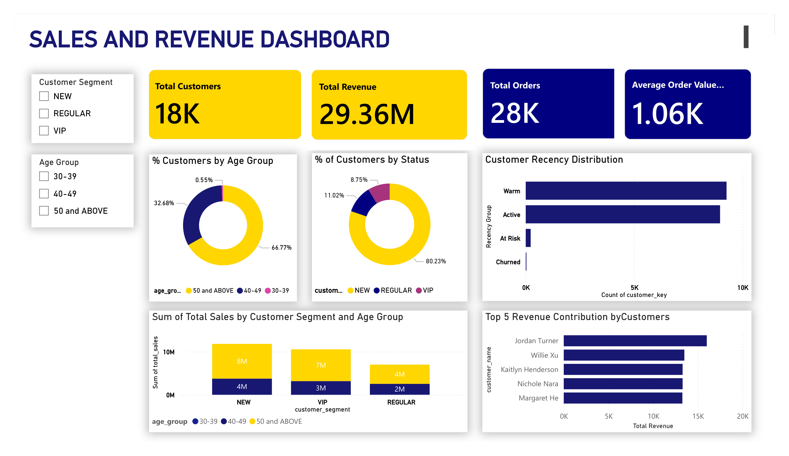

# 📊 SQL Analytics Project  

## Project Overview  

This project demonstrates the use of SQL to perform business-focused data analysis.  
The goal is to transform raw transactional datasets into meaningful insights that support strategy and decision-making.

## Business Value  

This project helps the business:

- Identify top-performing product categories  
- Understand pricing distribution  
- Optimise revenue strategy  
- Support data-driven pricing decisions  

## Scope of Analysis  

The analysis covers:

- Monthly sales performance summary 
- Yearly sales summary 
- Yearly cumulative (running) total of sales
- Year-over-Year (YoY) sales change and trend direction.
- Performance classification
- Product category contribution to overall sales  
- Segmentation of products into cost ranges and count distribution
- Customer Analytics View

## Some Key Skills Used

- SQL Aggregations  
- Window Functions 
- CASE Statements for segmentation  
- Common Table Expressions (CTEs)  
- Data grouping and sorting  
- Percentage calculations  

## Analytics Stack
- MySQL
- SQL
- Power BI

## Dashboard 

